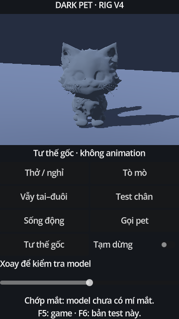

# Dark Pet — bản test rig v4

## Chạy

1. Đóng Godot trước khi cập nhật Git. Dùng nhánh `feat/dark-pet-3d-test`.
2. Mở `project.godot`, chờ import; mở `scenes/tests/pet_3d_test.tscn`, nhấn **F6**.
3. Tiêu đề phải là **DARK PET · RIG V4**. F5 vẫn chạy luồng trứng.

Mặc định là **Sống động**. Chạm/kéo trong khung để pet nhìn theo; **Gọi pet** đặt mục tiêu tại camera. Sau 3 giây không cập nhật, đầu nhả mục tiêu. Pet không vặn đầu về phía sau: xoay pet về phía camera nếu đang kiểm tra góc lưng.

**Thở/nghỉ**, **Tò mò**, **Vẫy tai–đuôi** là các clip kiểm tra riêng. **Test chân** chỉ kiểm tra xương một đoạn, chưa phải animation đi hoàn chỉnh. **Tạm dừng** giữ pose; **Tư thế gốc** tắt chuyển động và reset toàn bộ xương. Thanh xoay dùng để xem nhiều góc.



[Video render kiểm tra chế độ Sống động](previews/dark_pet_v4_living.mp4)

## Sửa từ video VID_20260927_165614.mp4

V3 có lỗi rig quan trọng: trọng số đuôi được phân vùng theo phía trái (-X), trong khi đuôi thật nằm phía sau (-Z). Vì vậy xương đuôi ảnh hưởng vào má/tai trái và phần đuôi thật nhận trọng số thân/đầu.

V4 sửa vị trí xương và inverse bind matrices; phân lại ảnh hưởng cổ/đầu/tai/chân và chuỗi đuôi theo hình học thực tế. Bốn đoạn đuôi hiện xoay theo trục yaw để vẫy ngang. File v3 được giữ nguyên. V4 giữ nguyên toàn bộ vertex positions, normals và chỉ số tam giác của mesh v3; chỉ sửa rig/skin và thêm vật liệu kiểm tra.

Ngoài ra:
- Camera orthographic gần hơn để nhìn rõ pet khi xoay.
- Vật liệu slate nhám, ánh sáng dịu hơn và bóng tiếp đất giúp đọc hình khối.
- Clip tò mò có nhịp quay/nghiêng đầu khác clip nghỉ; tai lệch pha và đuôi trễ từng đoạn.
- Bỏ dịch chuyển thân lên/xuống trong các clip chẩn đoán. Test chân dùng nhịp bốn chân lệch nhau và được ghi rõ là test rig.
- Tâm nhận mục tiêu nhìn lấy từ head rest pose thật, không dùng tọa độ đầu cũ.

## Đối chiếu bản model gốc

File Meshy gốc người dùng gửi có 64.842 vertex, không có skeleton, animation, material, texture, UV hoặc blend shape. V3 có 12.002 vertex, 24.000 triangle và 14 xương, cũng chưa có material/texture. Màu trắng không phải do Godot làm mất texture trong bước import này. V4 dùng vật liệu kiểm tra trung tính; chưa phải màu sắc hoàn thiện của nhân vật.

Chưa tạo mí mắt/chớp mắt, khớp gối, chest rig, IK, root motion hoặc clip Blender. Nhịp thở đang biểu đạt nhẹ ở cổ/đầu. Chất lượng bề mặt của mesh vẫn là mesh v3; các gờ/lõm của hình học không được coi là đã sửa bằng rig.

## Phân chia code

- `pet_3d_test_actor.gd`: nạp v4, chuyển quyền điều khiển giữa AnimationPlayer và chế độ Sống động.
- `dark_pet_test_clips.gd`: tạo các clip kiểm tra cùng tập track, vòng lặp kín.
- `motion/pet_rig_profile.gd`: tên xương và giới hạn góc riêng cho Dark Pet; head rest dùng +Z phía trước, +Y phía trên.
- `motion/pet_look_controller.gd`: mục tiêu world → rest frame, giới hạn góc, smoothing theo delta và thời gian chú ý.
- `motion/pet_secondary_motion.gd`: nhịp phản ứng, cooldown, tai lệch thời điểm và đuôi dao động tắt dần (chưa có vật lý va chạm).
- `motion/pet_motion_controller.gd`: ghép pose từ rest, fade khi vào chế độ; root/thân/chân giữ rest trong chế độ Sống động. RNG trình diễn riêng; không ghi save.

Không thay đổi main/GameApp hoặc luồng egg/hatch. Nhánh `feat/pet-foundation` là nhánh phát triển khác, không tự gộp vào test này.

## Tái tạo và kiểm tra

Cần Python + numpy để tái tạo asset; người chơi chỉ cần file GLB đã commit.

```bash
python tools/rig/refine_dark_pet_v4.py
python tools/rig/test_dark_pet_v4.py
godot --headless --path . --editor --import
godot --headless --path . --script res://tools/test_pet_3d.gd
godot --headless --path . --script res://tools/test_pet_living.gd
```

Đã kiểm tra bằng Godot 4.6.1, Compatibility renderer:
- Mesh v3/v4 giữ nguyên; rest skin không làm lệch hình. Trọng số hữu hạn, không âm, chuẩn hóa và chỉ số joint hợp lệ.
- Xoay đuôi không dịch chuyển vertex mặt; xoay đầu không dịch chuyển đuôi; đuôi thật có biến dạng theo bone.
- Clip, bone tracks, pause/resume/reset, chuyển chế độ, tọa độ chạm/multitouch, giới hạn góc, solver nhìn ở 30/60/120 FPS và cooldown đều đạt.
- Render thật bằng OpenGL: kiểm tra pose ở góc trước/bên/sau và chuỗi 120 frame Sống động. Ảnh/video phía trên xuất trực tiếp từ Godot.

Chưa kiểm tra Android/Godot 4.7, chưa khẳng định chuyển động đã đạt mức animation thành phẩm. Import editor vẫn có cảnh báo `export_presets.cfg` thiếu `preset.0/runnable` từ baseline.

Có thể tự chụp lại bằng Godot có display:

```bash
godot --path . --script res://tools/capture_pet_3d.gd -- /absolute/output/folder
```

Tài liệu API đối chiếu:
- https://docs.godotengine.org/en/4.6/classes/class_skeleton3d.html
- https://docs.godotengine.org/en/4.6/classes/class_camera3d.html
- https://docs.godotengine.org/en/stable/tutorials/animation/animation_tree.html
