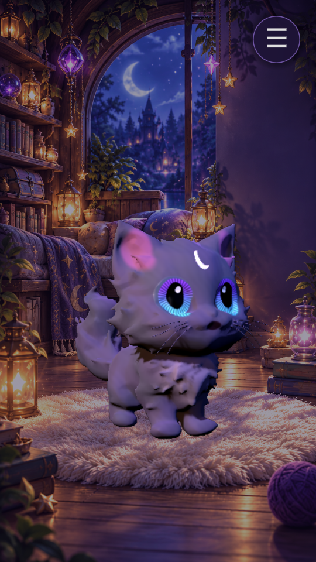
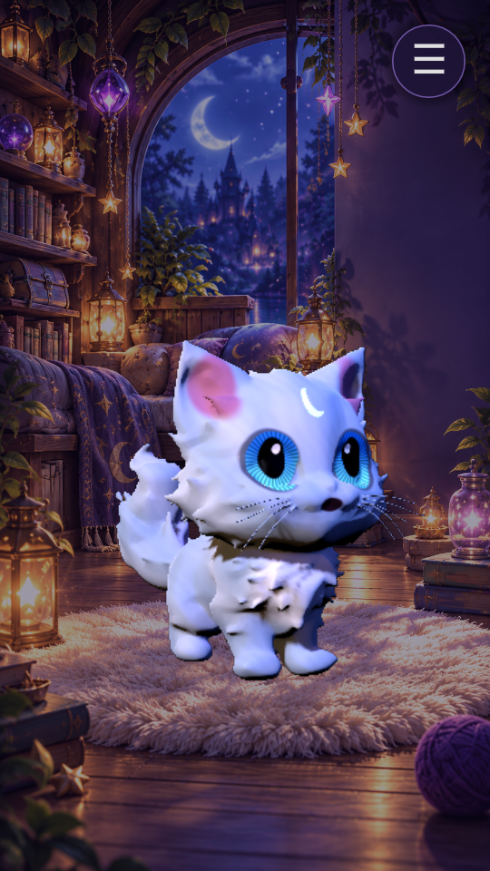

# Moonwhisker v4 appearance

PetHome uses `data/pet/appearance/moon_shadow.tres` via
`PetDefinition.appearance_profile`: slate/violet fur, pink ears, violet/cyan
eyes and an emissive crescent. `moon_frost.tres` demonstrates a second palette.




Both the Meshy source and v4 GLB have no textures or UVs. This is a procedural,
stylized first pass, not a reconstruction of the photograph's fluffy fur or smoke.

The appearance adapter copies the mesh once, stores rest XYZ in UV/UV2, and
preserves vertex/index/bone/weight arrays. Godot normal repacking is checked
within 0.0002 tolerance. Markings follow skinning. The source GLB, skin,
skeleton, animation tracks, simulation and saves are unchanged.
Each actor gets its own material; palette swaps reuse the cached mesh.
There are no per-frame appearance scripts, fur shells, extra lights or particles.

Mapping is specific to Moonwhisker v4's dimensions and orientation. It is not a
general new-species texture mapper. Current mesh has no blend shapes; a future
shape-key face requires extending the adapter to preserve blend shapes first.

## Usage

Duplicate a palette `.tres`, set its id/colors in the Inspector, then assign it
to a PetDefinition's `appearance_profile`. Runtime: `actor.set_appearance(profile)`.
F5 opens the game with the violet PetHome appearance. Open
`scenes/tests/pet_3d_test.tscn` with F6 for the violet/frost selector and rotation.
This test selector does not alter saved pet state or element.

## Validation

Godot 4.6.1 Compatibility:

```
godot --headless --path . --editor --import --quit
godot --headless --path . --script res://tools/test_pet_appearance.gd
godot --headless --path . --script res://tools/test_pet_3d.gd
godot --headless --path . --script res://tools/test_pet_living.gd
python tools/rig/test_dark_pet_v4.py
```

Verified geometry/weights, rest coordinates, actor isolation, cached swapping,
animation continuity, definition integration and existing rig/motion regression.
Both palettes rendered in the actual PetHome with software OpenGL.
Android performance has not been measured. Jagged sculpted fur remains;
higher fidelity needs mesh cleanup and artist-authored UV/PBR textures.

Reference: https://docs.godotengine.org/en/4.6/classes/class_meshinstance3d.html
